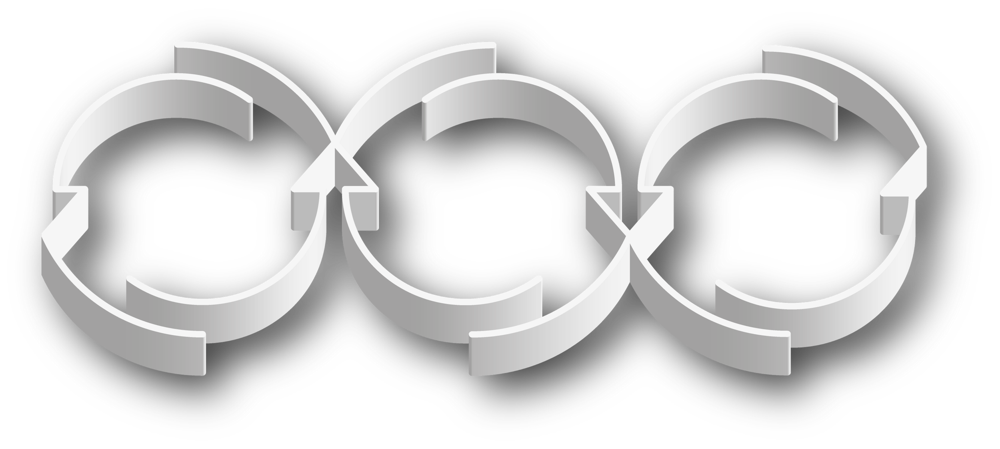
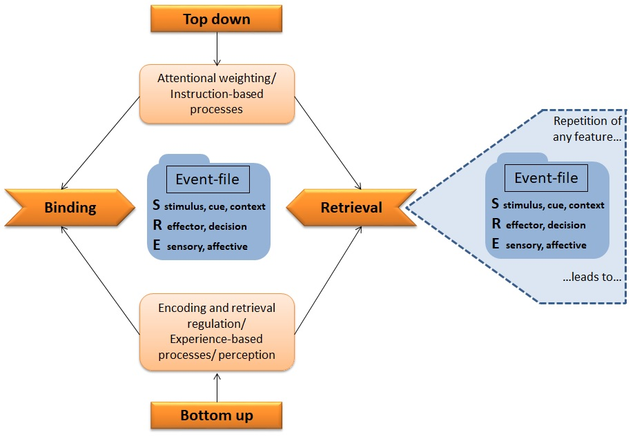

## [BRAC](https://brac-psy.de) is a framework that aims to explain human action control and execution by means of understanding relationship between stimulus-response and other cues from the environment. Research to explore this has been funded by the [DFG](https://www.dfg.de/) as a part of a Research unit consisting of multiple German Universities. 

---

### Understanding BRAC through Pavlovian Conditioning

My contribution to the Research Unit is by studying more long term phenomena such as learning and exploring how they influence short term stimulus response bindings in explaining action control and execution

#### 1. Selective learning (Overshadowing)

Learning in my research projects are established through contingencies and at the experimental level represented as a form of contingency learning where cues are contingent with a target stimulus. 
In this goal, we studied how saliency of cues can influence what is being learnt and how a more salient cue is learnt compared to absence of learning for the nonsalient cue which was also contingent with the stimulus.
Interestingly this seems to be driven by insight or awareness of the contingency between the cue and the stimulus and not by automatic build up of repetitive stimulus response pairings.

