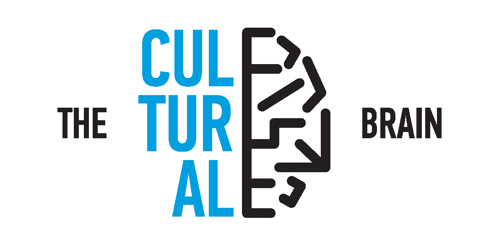

#### Reading and writing are cultural inventions that arose recently relative to the existence of the brain. This led to our brain having to adapt to the newer skills of reading and writing since it is not programmed bby default to do so. ([Huettig, Kolinsky & Lachmann,2018](https://pure.mpg.de/rest/items/item_2538749/component/file_2538748/content)

---

### Facial Recognition

See paper [here](https://journals.sagepub.com/doi/full/10.1177/0956797620971652) on whether learning to read affects visual perception of faces.

### Mirror Discrimination

Learn more about this in our [paper](https://pure.mpg.de/rest/items/item_3259117_3/component/file_3261431/content)

### Visual Illusions

Replicating a study done decades ago resulted in a different result. More details illustrated in our paper. Click [here](https://link.springer.com/article/10.1007/s41809-021-00080-x) to read more.

### Auditory Perception

